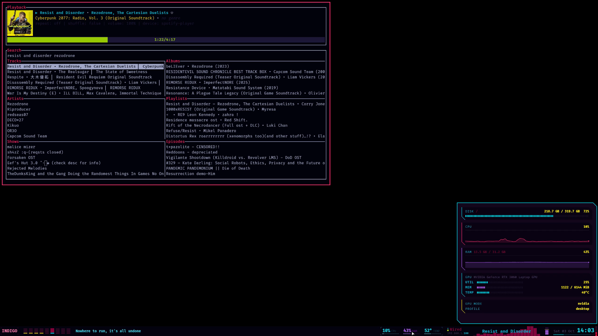
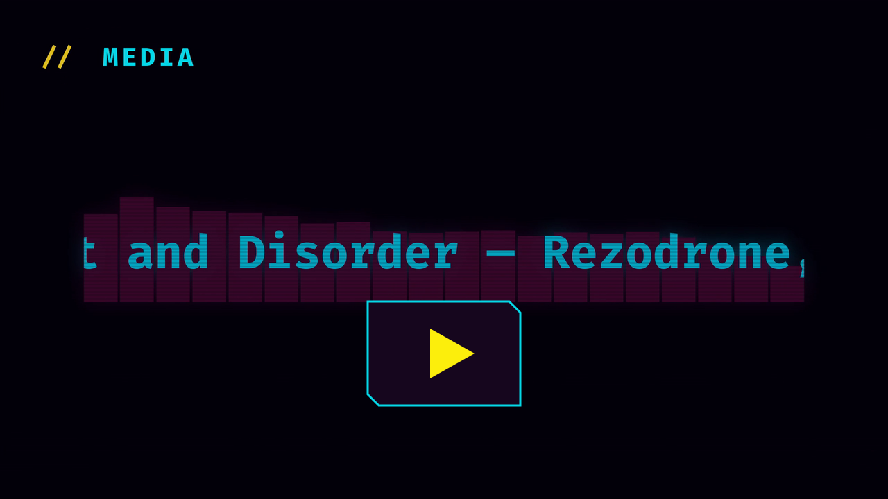
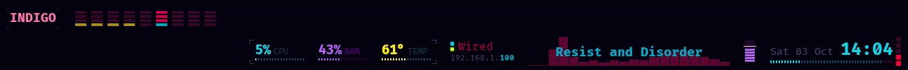
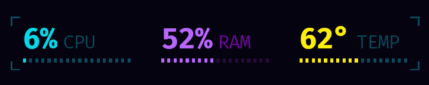
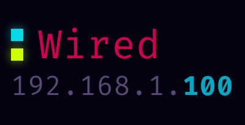
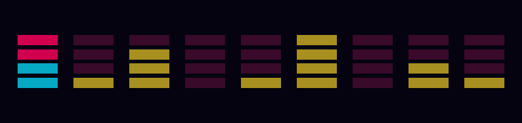
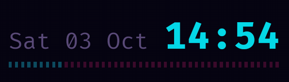
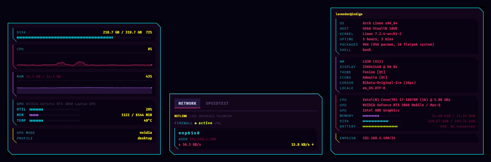
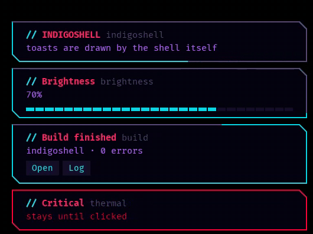
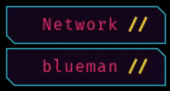

# indigoshell

A widget-engine desktop shell for X11. One Python process draws a bar,
its panels, its chord menus, its app launcher, its notification toasts
and its system tray on a single asyncio loop — no toolkit, no second
main loop, no worker threads.

<p align="center">
  
</p>

```
xcffib      windows, input, seat grabs, struts, ARGB visuals, RandR
skia        all rendering; SkSL shaders for the post-process effects
dbus-fast   notification daemon, StatusNotifierItem tray, MPRIS, dbusmenu
asyncio     X events, IPC, D-Bus, subprocesses and frame clocks, one loop
```

Styled out of the box with the INDIGO Cyberpunk palette: hot magenta,
electric cyan, neon yellow, violet accent, deep blue-violet base.

## Showcase

<p align="center">
  <a href="https://youtu.be/k2VP-eW4FqI">
    
  </a>
  <br>
  <a href="https://youtu.be/k2VP-eW4FqI">▶ indigoshell on qtile — the full tour (YouTube)</a>
</p>

Nothing in the video is played by hand: it was performed by synthetic
input, recorded at 1440p60 and cut by the scripts in
[`prototypes/showcase/`](prototypes/showcase/), and its closing reel is
the bar's own widget classes rendered on the GPU at several times their
size, cut to the song's beats.

## What it does

- **Bar** — a dock window that reserves its own strut, with a
  declarative widget tree (`Row([...])`, `Box`, `Spacer`, `Brackets`).

  

- **Widgets** — plain at rest, animated when something happens:
  - **workspaces**, each a stack of bars for its window count, an urgent
    one ringing red;
  - the **INDIGO** tag, breathing slowly;
  - **lyrics** piped from `sptlrx`, each line arriving with a glitch-wipe
    reveal and pulsing on the beat;
  - **CPU / RAM / TEMP** meters framed as one cluster by corner brackets,
    TEMP sweeping cyan → yellow → red;
  - **network**, with two dots that blink with throughput (cyan sent,
    lime received) over the address;
  - **now playing**, the title scrolling over a cava visualiser that
    tints on every beat, with the odd binary glitch;
  - **volume**, a level stack under a yellow cap;
  - the **clock**, with a battery underline that sweeps while charging
    or discharging and shimmers lime when full;
  - the **system tray**.

  <table>
    <tr>
      <td align="center"><br><sub>now playing</sub></td>
      <td align="center"><br><sub>lyrics</sub></td>
    </tr>
    <tr>
      <td align="center"><br><sub>meters</sub></td>
      <td align="center"><br><sub>network</sub></td>
    </tr>
    <tr>
      <td align="center"><br><sub>workspaces</sub></td>
      <td align="center"><br><sub>clock + battery</sub></td>
    </tr>
  </table>

- **Panels** — `system` (fastfetch), `hardware` (CPU/RAM history, live
  GPU readouts), `network` (interfaces, wifi, firewall, a streamed
  `speedtest-cli` run). Anchored to a screen edge, dismissed by clicking
  outside — and by Escape where the window takes a keyboard grab — and
  kept alive between opens, so a keybind shows one in the time a close
  would take.

  

- **Chord menus** — a keybind opens a stack of chips at the bottom
  right; a digit picks, Escape backs out. Shipped: power, display,
  layout, profile, audio, graphics. An action that returns another
  `Menu` becomes the next stage in the same window, so multi-step flows
  are just functions returning menus.

  

- **Launcher** — replaces rofi's `drun`: a centred panel over every
  installed desktop entry, with their theme icons, fuzzy matching (fzy's
  scorer, case- and accent-blind, matched letters lit) and launch
  history that lifts the apps actually used. Type straight away — keys
  pressed during the spawn animation are kept. Shift+Return runs the
  query as a command line. Apps start in their own systemd scope,
  detached from the shell, so a reload never takes them down.

  

- **Notifications** — a full `org.freedesktop.Notifications` daemon,
  replacing dunst. One window per toast, so the spawn and despawn
  animations play per notification; urgency styling, images, action
  chips, replace-by-id, and a segmented meter when a `value` hint
  arrives. The border traces the remaining time; hovering any toast
  pauses them all; a critical one stays until clicked.

  

- **System tray** — registers as `org.kde.StatusNotifierWatcher` and
  Host. Compatible with `nm-applet --indicator`, `blueman-applet`,
  `udiskie --tray`, Discord, Steam. Right-click opens the app's own
  menu, walked over `com.canonical.dbusmenu` and drawn as our own rows.

  

- **GPU effects** — every window can run a chain of SkSL post-process
  passes over its finished frame. Panels open with `ScanLock`, a
  scan-lock reveal where bands snap in out of order with a sideways tear
  and an RGB split. Rendering goes through an EGL/GL surface when one
  can be created and falls back to CPU raster when it can't.

  

- **Damage-driven repaint** — a window only paints the rectangles that
  changed, and only wakes at the highest `animation_fps` any visible
  widget asks for. A still bar costs nothing.
- **Hot reload** — `--watch` re-execs on `.py` change, or
  `indigoshell reload` over the control socket.

## Architecture

```text
indigoshell/
  app.py            ─ entry point: client mode vs daemon mode, config load
  api.py            ─ open/close/toggle handlers for config files
  window.py         ─ WindowSpec + the live window: layers, anchors,
                      struts, grabs, frame clock, damage, effect chain
  theme.py          ─ palette, semantic tokens, per-widget presets
  shapes.py         ─ the beveled rectangle, as a skia.Path
  text.py           ─ font cache, measurement, tracked drawing
  fuzzy.py          ─ fzy's scorer with match positions, accent folding
  effects.py        ─ Effect base + ScanLock, Decode, GlitchWipe,
                      Aberration, ColorSplit (SkSL)
  plugin.py         ─ plugin contract: Menu, Item
  config_default.py ─ the shipped bar, panels, menus and services
  backend/
    x11.py          ─ the process's single xcffib connection + event pump
    gl.py           ─ EGL/GL surfaces for Skia, with a raster fallback
  core/
    daemon.py       ─ the loop: windows, services, IPC, signals, reload
    ipc.py          ─ control socket (line-delimited JSON over AF_UNIX)
    client.py       ─ the CLI side of that socket
    registry.py     ─ plugin discovery, shipped then user, later winning
    naming.py       ─ APP / CLI / env prefix, derived from the package
    paths.py        ─ socket, lock, config, state and log locations
    state.py        ─ small JSON file for choices that outlive a run
    singleton.py    ─ the lock that keeps one daemon per session
    log.py          ─ colored stderr, optional rotating file
  plugins/          ─ shipped chord menus
    system.py       ─ power, keyboard layout, tuned profile, GPU mode
    audio.py        ─ default sink / source, two stages
    display.py      ─ pick an output; remembers and restores it
  services/         ─ non-drawing, subscribe-based brokers
    bus.py          ─ the one shared D-Bus session connection
    notifications.py─ org.freedesktop.Notifications server
    systray.py      ─ StatusNotifierWatcher + Host
    dbusmenu.py     ─ com.canonical.dbusmenu client
    music.py        ─ playerctl --follow status broker
    beat.py         ─ cava bands + aubio beat detection, both lazy
    sysinfo.py      ─ 1Hz CPU/RAM sampler, direct-sysfs temperature
    apps.py         ─ installed-app catalog, ranked search, launch history
    desktop_entry.py─ .desktop parsing, visibility, Exec -> argv
    icons.py        ─ icon theme lookup (indexed once) and loading
    proc.py         ─ run / fire / launch / subscribe, all coroutines
    text_effects.py ─ scramble and other arrival animations
  widgets/          ─ measure / arrange / paint / hit, and nothing else
    base.py           layout.py    label.py     panel.py    tabs.py
    workspaces.py     systag.py    clock.py     volume.py   network.py
    media.py          meters.py    hud.py       menu.py     systray.py
    notification.py   line_graph.py stdout_text.py
    hardware_panel.py network_panel.py fastfetch.py
    launcher.py       text_input.py
prototypes/
  visuals/          ─ offline design sheets and GIFs, from the real widgets
  showcase/         ─ the scripted demo: XTEST input, staging, recording,
                      the GPU-rendered widget reel, the ffmpeg cut
```

### Conventions

- **The widget contract is four methods** — `measure`, `arrange`,
  `paint`, `hit` ([widgets/base.py](indigoshell/widgets/base.py)).
  Containers are widgets, so a bar, a panel and a toast hold the same
  type. Nothing in the contract mentions X11 or the host window.
- **A window is a `WindowSpec`, not a subclass.** A bar is a spec whose
  layer is `DOCK` and which reserves space; a toast is the same type at
  `OVERLAY` with no reservation; a chord menu is the same type with
  override-redirect and a seat grab. The vocabulary (anchor, layer,
  exclusive zone) is borrowed from Wayland's layer-shell.
- **Names derive from the package.** `core/naming.py` reads `APP` from
  `__package__`, and the daemon name, socket, config dir, state file,
  log file and `INDIGOSHELL_*` env vars all follow it.
- **All subprocess work goes through
  [`services/proc.py`](indigoshell/services/proc.py)** — `run`, `fire`,
  `launch`, `subscribe`, every one a coroutine. Anything the user starts
  goes through `launch`, never `fire`: a reload re-execs the daemon in
  place, and a child it started before that is never reaped.
- **Keys arrive as a `KeyEvent`** — the keysym for shortcuts, the typed
  `text` for fields, and the modifiers resolved from the live modifier
  map (AltGr is not Alt). The keymap is re-read on every keyboard grab,
  so a layout switch is picked up by the next menu or launcher.
- **Services are brokers, widgets render.** A service owns the D-Bus or
  subprocess side and publishes to subscribers; it never draws. Backends
  that cost something (cava, aubio) are reference-counted and only exist
  while a widget is subscribed.

## Running

```bash
uv sync
.venv/bin/python main.py                     # foreground
.venv/bin/python main.py --watch             # re-exec on .py change
.venv/bin/python main.py --log-level debug --log-file
```

`uv sync` also installs an `indigoshell` console script into
`.venv/bin`. Running `main.py` by absolute path works from any
directory — the file's own directory lands on `sys.path` — which is what
lets a window manager spawn it without a PATH entry.

Client verbs (same binary; the first argument decides):

```bash
indigoshell open <window>       indigoshell list
indigoshell close <window>      indigoshell ping
indigoshell toggle <window>     indigoshell reload
indigoshell menu <menu>         indigoshell kill
```

### Window manager integration

The shell asks for nothing from the WM except that it leave its windows
alone. With qtile:

```python
INDIGOSHELL = ["/path/to/.venv/bin/python", "/path/to/main.py"]

Key([MOD], "d",             lazy.spawn(INDIGOSHELL + ["toggle", "launcher"])),
Key([MOD], "Escape",        lazy.spawn(INDIGOSHELL + ["menu", "power"])),
Key([MOD, SHIFT], "s",      lazy.spawn(INDIGOSHELL + ["menu", "display"])),
```

Every window sets `WM_CLASS` to `(instance=window name, class="indigoshell")`,
so one float rule covers all of them:

```python
Match(wm_class="indigoshell")
```

## Configuration

A user config at `~/.config/indigoshell/config.py` replaces the shipped
one. It exports `WINDOWS` and, optionally, `SERVICES`, `MENUS`,
`STARTUP` and `SCREEN`:

```python
from indigoshell.widgets.layout import Row
from indigoshell.widgets.clock import Clock
from indigoshell.window import Anchor, Layer, WindowSpec

WINDOWS = [
    WindowSpec(
        name="bar",
        layer=Layer.DOCK,
        anchor=Anchor.BOTTOM,
        size=(None, 34),
        exclusive=True,        # reserve the strut
        focusable=False,
        autostart=True,
        content=Row([Clock()]),
    ),
]
```

[`config_default.py`](indigoshell/config_default.py) is the worked
example: six windows — the bar, three panels, the chord menu and the
launcher — the widget set, and the reasoning behind the numbers.

### Plugins

A plugin is a Python module under `~/.config/indigoshell/plugins/`
exporting any of `MENUS`, `STARTUP` or `SCREEN`. A user file whose name
matches a shipped one replaces it, so overriding `audio.py` means
copying it and editing, not patching around it.

```python
from indigoshell.plugin import Item, Menu

MENUS = [Menu("power", "POWER", [
    Item("SUSPEND",  ["systemctl", "suspend"]),
    Item("REBOOT",   ["systemctl", "reboot"]),
    Item("POWEROFF", ["systemctl", "poweroff"]),
])]
```

An item's action may be an argv list (run it, close the menu), a
callable (sync or async), or a callable returning another `Menu` — which
the shell shows as the next stage in the same window. `items` may itself
be a callable, resolved when the stage is about to appear, for lists
that only exist once a tool has been asked (the outputs `xrandr` knows
about, the sinks `pactl` reports).

`STARTUP` hooks are awaited before any window is created; `SCREEN` hooks
after the screen or an output's connection changes. The display plugin
uses both to restore the output you chose last.

### Environment

| Variable | Effect |
|---|---|
| `INDIGOSHELL_LOG_LEVEL` | default log level (`info`) |
| `INDIGOSHELL_GPU=0` | force the CPU raster path |
| `INDIGOSHELL_DPI` | point-to-pixel scaling (default 96) |
| `INDIGOSHELL_FORCE_COLOR` | keep ANSI colors when stderr isn't a tty |

Runtime files: `$XDG_RUNTIME_DIR/indigoshell-$UID.{sock,lock}`, state in
`$XDG_STATE_HOME/indigoshell/state.json`.

## Dependencies

Python (declared in `pyproject.toml`, needs 3.14+): `xcffib`,
`skia-python`, `dbus-fast`, `psutil`, `watchdog`.

On `PATH`, each optional — the widget or menu that needs one degrades
rather than failing:

| Tool | Used by |
|---|---|
| `cava` | media visualiser |
| `parec` + Python `aubio` | beat detection |
| `playerctl` | media status and controls |
| `sptlrx` | synced lyrics |
| `fastfetch` | system panel |
| `nmcli`, `iw`, `speedtest-cli` | network widget and panel |
| `pactl` | volume widget, audio menu |
| `xrandr`, `setxkbmap` | display and layout menus |
| `tuned-adm`, `optimus-manager` | profile and graphics menus |
| `setsid` (util-linux) | launcher: detaches the apps it starts |
| `systemd-run` + a user manager | launcher: one scope per app; skipped without |
| `kitty` | launcher: `Terminal=true` apps (the `terminal=` option) |

A Nerd Font is expected for the glyphs; `FiraCode Nerd Font Mono` is the
theme default.

**aubio** has no wheel for this interpreter and exists only as a distro
package (Arch: `python-aubio`), so the venv has to see the system's
site-packages: `include-system-site-packages = true` in
`.venv/pyvenv.cfg`, which `uv venv --system-site-packages` sets. `uv
sync` resets that flag again, so `services/beat.py` falls back to
probing `sys.base_prefix` directly — a venv rebuild costs the flag, not
the feature.

## Status

Personal project, single-author, and shaped around one machine's
hardware. Stable as a daily driver; the API still moves.
